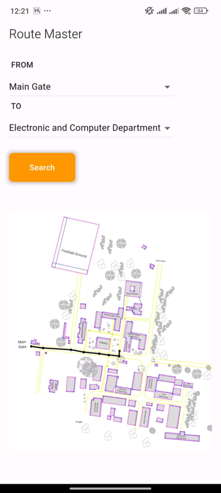
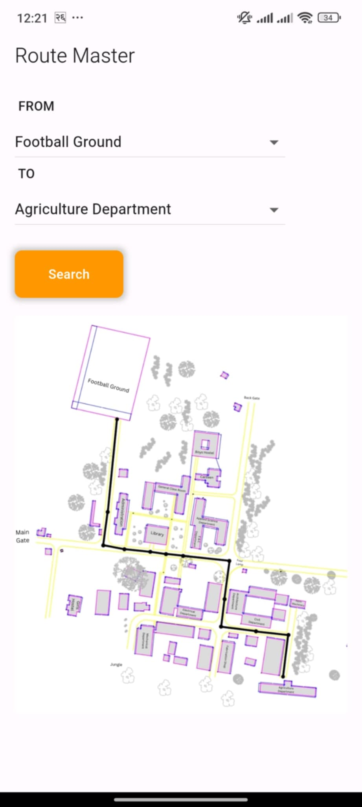
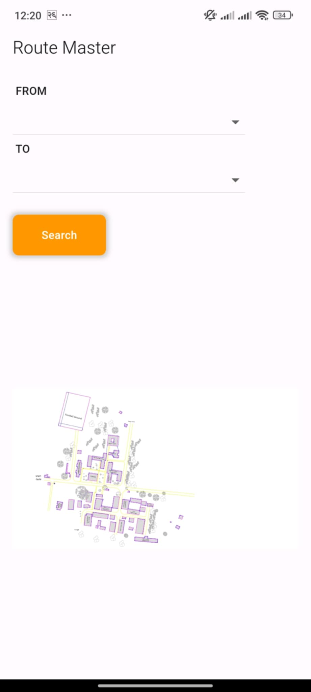

# 📍 Route Finder – ERC Campus Navigation Tool
## Introduction

This project is a **campus navigation tool** that utilizes **graph theory** to determine the shortest path between two locations on the **Eastern Regional Campus (ERC)**. By implementing **Dijkstra’s algorithm**, it computes optimal routes based on **real-world distance measurements**, enabling accurate and efficient navigation across the campus.

---
## 🚀 Features

- **Accurate Distance Mapping**: Collaborated with Civil Engineering students to record real-world distances between campus points.  
- **Graph-Based Representation**: The campus map is modeled as a weighted graph, where nodes represent landmarks (buildings, intersections) and edges represent distances.  
- **Shortest Path Computation**: Implements **Dijkstra’s algorithm** to calculate the most efficient route between any two points.  
- **Topological Map Visualization**: Computed routes are overlaid on the campus map for intuitive navigation.  
- **User-Friendly Interface**: Simple selection of source and destination points with real-time route display.
---
## 🛠️ Technologies Used

- **Flutter / Dart** – Cross-platform mobile application development.  
- **Graph Data Structures** – Efficient storage and traversal of nodes and edges.  
- **Dijkstra’s Algorithm** – Core logic for shortest-path computation.  
- **Real-World Measurements** – Collaboration for precise distance mapping.

---
## 🗺️ How It Works

1. **Node Representation** – Each building, pathway, or intersection is modeled as a node.  
2. **Edge Weights** – Distances between nodes are measured and stored as edge weights.  
3. **User Input** – Users select a source and destination.  
4. **Shortest Path Calculation** – Dijkstra’s algorithm computes the optimal route.  
5. **Route Visualization** – The resulting path is displayed on the topological campus map.
---
## 🔧 Installation

Clone the repository:

```bash
https://github.com/arpanneupane75/Route-Master.git
cd route-master
```

Run the application (example for Java):

```bash
flutter pub get
flutter run 
```

---
## 📸 Screenshots




---
## 🤝 Collaboration

1. This project was developed in collaboration with Civil Engineering students to ensure:

2. Realistic spatial data and accurate measurements.

3. Practical usability for navigating the campus.

4. Seamless integration of theoretical graph models with real-world data.

---
## 📄 License

This project is open source and available under the [MIT License](LICENSE).
---
## 🔗 Future Enhancements

1. Dynamic route updates for construction zones or temporary closures.

2. Expansion to cover larger campuses or city maps.

3. Integration with GPS for outdoor navigation and real-time positioning.
